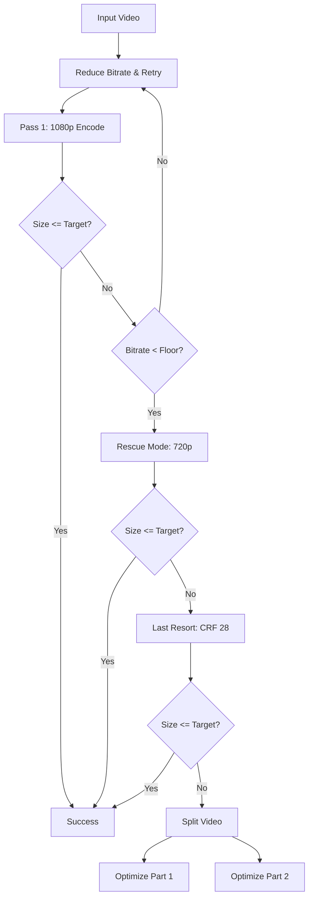

# ffmpeg-shrinkwrap 📦


**A constraint-driven video compression pipeline designed for the Discord-bound.**

`ffmpeg-shrinkwrap` is a Bash utility that aggressively bullies video files until they fit under strict file size limits (default: <10MB).

Unlike static presets, it uses **dynamic bitrate calculation** and a **heuristic state machine** to balance quality against size constraints. It automates the "trial and error" process of encoding, retrying, downscaling, and splitting.

## Key Features

* **Smart UX:** Now features **visual progress bars** for encoding passes and handles `Ctrl+C` gracefully (automatically cleaning up temporary files).
* **Target-Based Encoding:** Calculates exact bitrates to fill the target size without wasting space.
* **Heuristic "Rescue" Logic:**
    * **Phase 1:** Retries 1080p with reduced bitrate.
    * **Phase 2:** Downscales to 720p if bitrate floor is hit.
    * **Phase 3 (New):** If 2-pass encoding fails, attempts a "Last Resort" generic CRF 28 pass.
    * **Phase 4:** Splits the video at the nearest keyframe to the midpoint.
    *   *Fallback:* If keyframe data is malformed or missing, it forces a hard geometric split and **repairs the stream structure** during the subsequent re-encoding pass.
* **Broad Compatibility:** Automatically detects your FFmpeg version to use the correct flags (`-vsync` vs `-fps_mode`) and ensures `yuv420p` pixel format for playback on all devices.
* **Post-Mortem Reports:** Generates a summary of compression ratios and actions taken.
* **High Efficiency:** Uses `libx265` (HEVC) 2-pass encoding.


## How It Works

### The Math
Instead of guessing a CRF value, the script calculates the target video bitrate ($b_v$) based on the target size ($S$), duration ($t$), audio bitrate ($b_a$), and container overhead ($O$):

$$b_v = \frac{(S - O) \times 8}{t} - b_a$$

### The Logic Flow
The script follows a "waterfall" strategy to preserve quality:



## Usage

Make the script executable:

```bash
chmod +x ffmpeg_shrinkwrap.sh
```

Run on all MP4s in the current folder:

```bash
./ffmpeg_shrinkwrap.sh
```

### Options

| Flag | Argument | Description | Default |
| :--- | :--- | :--- | :--- |
| `-t` | `<float>` | Target file size in MB | `9.8` |
| `-p` | `<string>` | FFmpeg x265 preset (slow, medium, fast) | `slow` |
| `-v` | `<int>` | Minimum video bitrate floor (kbps) | `500` |
| `-a` | `<int>` | Minimum audio bitrate floor (kbps) | `64` |
| `-r` | `<int>` | Max retries per resolution pass | `3` |
| `-n` | `flag` | No cleanup (keep logs/temp files) | `off` |

### Examples

**Target 25MB (Discord Nitro Basic):**
```bash
./ffmpeg_shrinkwrap.sh -t 24.5 -p medium video.mp4
```

**Aggressive compression for slow connections (5MB):**
```bash
./ffmpeg_shrinkwrap.sh -t 5.0 -v 300 -a 48 video.mp4
```
## Real-World Results

Here is a sample log from a batch of GTA V clips (Target: 10MB). Notice how the script consistently hits the ~9.5MB mark, regardless of whether the input was 30MB or 150MB.

```text
File                                     Orig Size    Final Size   Reduction %  Status         
-------------------------------------------------------------------------------------
Grand Theft Auto V Enhanced 2025.03.10 - 150.311      9.983        93.00        Optimized      
Grand Theft Auto V Enhanced 2025.03.10 - 141.408      9.254        93.00        Optimized      
Grand Theft Auto V Enhanced 2025.03.10 - 68.718       9.465        86.00        Optimized      
Grand Theft Auto V Enhanced 2025.03.10 - 72.699       9.555        86.00        Optimized      
Grand Theft Auto V Enhanced 2025.03.10 - 65.831       8.550        87.00        Optimized      
Grand Theft Auto V Enhanced 2025.12.09 - 33.345       9.373        71.00        Optimized      
Grand Theft Auto V Enhanced 2025.12.09 - 30.213       9.350        69.00        Rescued (1080p)
Grand Theft Auto V Enhanced 2025.12.09 - 42.359       9.910        76.00        Optimized      
Grand Theft Auto V Enhanced 2025.12.09 - 134.305      9.513        92.00        Optimized      
Grand Theft Auto V Enhanced 2025.12.09 - 66.862       9.901        85.00        Optimized      
Grand Theft Auto V Enhanced 2025.12.09 - 80.408       9.614        88.00        Optimized      
Grand Theft Auto V Enhanced 2025.12.09 - 207.295      9.637        95.00        Optimized      
Grand Theft Auto V Enhanced 2025.12.09 - 58.024       8.106        86.00        Optimized      
Grand Theft Auto V Enhanced 2025.12.09 - 71.364       9.848        86.00        Optimized      
Grand Theft Auto V Enhanced 2025.12.09 - 53.425       8.781        83.00        Optimized      
Grand Theft Auto V Enhanced 2025.12.09 - 66.195       9.957        84.00        Optimized      
Grand Theft Auto V Enhanced 2025.12.09 - 118.855      9.372        92.00        Rescued (1080p)
Grand Theft Auto V Enhanced 2025.12.09 - 40.269       9.922        75.00        Optimized      
Grand Theft Auto V Enhanced 2025.12.09 - 32.013       9.680        69.00        Optimized      
Grand Theft Auto V Enhanced 2025.12.09 - 48.262       9.986        79.00        Optimized      
Grand Theft Auto V Enhanced 2025.12.09 - 27.268       9.510        65.00        Optimized      
Grand Theft Auto V Enhanced 2025.12.10 - 49.504       9.461        80.00        Optimized      
```
## Dependencies

Required tools (must be in your `$PATH`):

*   `ffmpeg` (Recommend version 5.0+, but script auto-adapts to older versions)
*   `ffprobe`
*   `bc` (for floating-point math)
*   `awk`

**Debian/Ubuntu/WSL:**
```bash
sudo apt update && sudo apt install ffmpeg bc gawk
```

## License

MIT License. Free to use, modify, and distribute.
