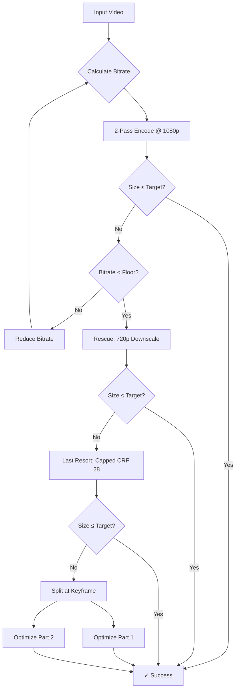

# ffmpeg-shrinkwrap 📦


**A constraint-driven video compression pipeline designed for the Discord 20MB file limit.**

`ffmpeg-shrinkwrap` automatically **compresses an entire directory worth of videos to fit Discord's 20MB limit** (or any target size) using **dynamic bitrate calculation** and intelligent fallback strategies. Works on Linux, macOS, WSL, and native Windows.

Unlike static presets, it calculates exact bitrates and uses a **heuristic** to balance quality against size constraints, automating the "trial and error" process of encoding, retrying, downscaling, and splitting.

## Key Features

* **Cross-Platform:** Native Bash for Linux/macOS/WSL, PowerShell for Windows
* **Clean UX:** Start banner, per-file `[i/N]` batch counter, live per-pass progress (Bash), and an end-of-run summary (status counts, total saved, elapsed). Graceful Ctrl+C cleanup (Linux/macOS **and** Windows), automatic cleanup
* **Target-Based Encoding:** Calculates exact bitrates to fill the target size without wasting space
* **Bidirectional Convergence:** If a 2-pass result lands well under target, it re-encodes once at a higher bitrate to reclaim the unused headroom -- better quality, not just "under the limit"
* **Multi-Format Input:** Accepts `mp4`, `mkv`, `mov`, `avi`, `webm`, `m4v`, `flv` (output is always `.mp4`)
* **Intelligent Fallback Chain:**
    * **Phase 1:** Adaptive retry with bitrate convergence (2-pass x265)
    * **Phase 2:** 720p rescue mode if bitrate floor is hit
    * **Phase 3:** Last-resort **capped** CRF 28 (`-crf 28 -maxrate -bufsize`) -- CRF quality that still can't exceed the size cap
    * **Phase 4:** Keyframe-aware splitting (scans packet flags for the nearest keyframe before the midpoint)
* **High Efficiency:** Uses `libx265` (HEVC) 2-pass encoding by default, with **opt-in GPU encoders** (AMF / NVENC / QSV / VideoToolbox via `-c hw`) that are functionally probed and fall back to software automatically
* **Broad Compatibility:** Auto-detects FFmpeg version for correct flags, ensures `yuv420p` for universal playback
* **Post-Mortem Reports:** Generates compression summary with before/after stats

---

## Installation
### ⊞ Windows Installation & Usage

#### Quick Start
1. **Download** - Click `Code → Download ZIP` and extract
2. **Run** - Double-click `drag_videos_here.bat`
   - First time: Press `Y` to auto-download FFmpeg (~100MB, one-time)
   - After setup: Drag videos onto the .bat file to compress or double-click to compress all videos in current directory 

**That's all Folks!** Compressed videos appear in the `optimized` folder.

#### Usage Options
- **Option A:** Drag video file(s) onto `drag_videos_here.bat`
- **Option B:** Drag an entire folder onto `drag_videos_here.bat`
- **Option C:** Double-click `drag_videos_here.bat` to process all videos in current folder

#### Arguments (PowerShell)
```powershell
.\shrinkwrap.ps1 -Files "clip.mp4"                                      # Process single file (19.8MB default)
.\shrinkwrap.ps1 -TargetSizeMB 49 -Preset medium -Files "clip.mp4"     # Target 50MB Nitro Basic upload
.\shrinkwrap.ps1 -Encoder hw -Files "clip.mp4"                          # Use GPU hardware acceleration
.\shrinkwrap.ps1 -NormalizeAudio -Mono -Files "clip.mp4"                # Normalize loudness + downmix mono
.\shrinkwrap.ps1 -NoAudio -Files "clip.mp4"                             # Strip audio completely (-an)
.\shrinkwrap.ps1 -Config                                                # Interactive setup wizard
```

**Parameters:**
```
-Encoder <string>        Video encoder: auto (default), hw, or a specific encoder name
                         (see "Hardware-accelerated encoding" below)
-Preset <string>         FFmpeg preset (slow/medium/fast, default: slow)
-TargetSizeMB <float>    Target file size in MB (default: 19.8)
-MinVideoBitrate <int>   Video bitrate floor in kbps (default: 500)
-MinAudioBitrate <int>   Audio bitrate floor in kbps (default: 64)
-MaxRetries <int>        Max retry attempts (default: 3)
-NormalizeAudio          Loudness-normalize audio (EBU R128, -16 LUFS, two-pass)
-Mono                    Downmix audio to mono (frees budget on voice-only clips)
-NoAudio                 Remove audio entirely (-an); frees the whole budget for video
-OutputDir <string>      Output directory path (default: optimized)
-NoCleanup               Keep logs and temp files for debugging
-Config                  Setup wizard: pick/persist a default encoder, then exit
                         (see "Saved preferences" below)
```

#### Troubleshooting
**"FFmpeg download failed"**  
Download manually from [gyan.dev/ffmpeg/builds](https://www.gyan.dev/ffmpeg/builds/) (officially listed at [ffmpeg.org](https://ffmpeg.org/download.html#build-windows)), extract `ffmpeg.exe` and `ffprobe.exe`, place in shrinkwrap folder.

**"Script won't run / security warning"**  
Windows may block scripts downloaded from the internet.
Right-click `drag_videos_here.bat` → Properties → Unblock → OK


---

### 🐧 Linux / macOS Installation

#### Quick Install (System-Wide)
```bash
# Clone repo
git clone https://github.com/nunogomes255/ffmpeg-shrinkwrap.git
cd ffmpeg-shrinkwrap

# Install globally and make executable
sudo cp shrinkwrap /usr/local/bin/ffmpeg-shrinkwrap
sudo chmod +x /usr/local/bin/ffmpeg-shrinkwrap
```

**Now run from anywhere:**
```bash
cd /path/to/your/videos
ffmpeg-shrinkwrap
```

#### Usage
Process all .mp4 files in current directory:
```bash
./shrinkwrap
```

Process specific files:
```bash
./shrinkwrap clip1.mp4 clip2.mp4
```

#### Options
```
-c <string>   Video encoder: auto (default), hw, or a specific encoder name
              (see "Hardware-accelerated encoding" below)
-t <float>    Target file size in MB (default: 19.8)
-p <string>   FFmpeg x265 preset (slow/medium/fast, default: slow)
-v <int>      Minimum video bitrate floor in kbps (default: 500)
-a <int>      Minimum audio bitrate floor in kbps (default: 64)
-r <int>      Max retries per resolution pass (default: 3)
-l            Normalize audio loudness (EBU R128 / -16 LUFS, two-pass)
-m            Downmix audio to mono (frees budget on voice-only clips)
-A            Remove audio entirely (-an); frees the whole budget for video
-o <string>   Output directory path (default: optimized)
-n            No cleanup - preserve logs/temp files for debugging
-h            Display help
--config      Setup wizard: pick/persist a default encoder, then exit
              (see "Saved preferences" below)
```

#### Examples
```bash
./shrinkwrap clip.mp4                          # Process single file (19.8MB default)
./shrinkwrap -t 49 -p medium clip.mp4          # Target 50MB Discord Nitro Basic
./shrinkwrap -c hw clip.mp4                    # Auto-pick best working GPU encoder
./shrinkwrap -c hevc_nvenc clip.mp4            # Force NVIDIA NVENC HEVC encoder
./shrinkwrap -l -m clip.mp4                    # Normalize loudness + downmix to mono
./shrinkwrap -A clip.mp4                       # Strip audio completely (-an)
./shrinkwrap --config                          # Run interactive setup wizard
```

---

### Hardware-accelerated encoding (opt-in)

By default the tool uses **software `libx265` 2-pass** -- this is unchanged and remains the
recommended path for the best quality at a hard size cap. GPU encoders can be enabled
explicitly with `-c` (Bash) / `-Encoder` (PowerShell):

| Value | Behavior |
|-------|----------|
| `auto` *(default)* | Software detection (`libx265`, else `libx264`), 2-pass. No change to default runs. |
| `hw` | Probe the GPU hierarchy **AV1 -> HEVC** across AMF / NVENC / QSV / VideoToolbox; use the first that works, else fall back to software. |
| *encoder name* | Force a specific encoder, e.g. `hevc_nvenc`, `av1_amf`, `h264_qsv`, `hevc_videotoolbox`. |

Every hardware encoder is **functionally validated** with a tiny test encode before use
(being compiled into FFmpeg does **not** mean the machine can run it), so a missing or
non-functional GPU encoder is rejected and the tool **falls back to software** rather than
crashing mid-batch. Hardware encodes are **single-pass capped VBR** (NVENC adds
`-multipass fullres`); the CRF rescue maps to vendor constant-quality (`-cq` / `-global_quality`).
**Presets are universal.** Whatever you pass to `-p`/`-Preset` -- an x264/x265 name
(`ultrafast`...`placebo`), or another vendor's token (AMF `quality`/`balanced`/`speed`, NVENC
`p1`...`p7`) -- is normalized to a **valid token for whichever encoder actually runs**, via three
speed tiers (fast / medium / slow). So `-p veryfast` becomes AMF `speed`, `-p quality` becomes
NVENC `p7` on an NVENC encoder, and so on; a token already native to the chosen encoder (and the
finer x264/QSV names) passes through unchanged. If you hand it a token from a *different* vendor
(or a typo), it still runs, but you get a one-line `[Preset]` warning plus a cheat-sheet of the
valid presets per encoder. The default `slow` is silent.

```bash
./shrinkwrap -c hw clip.mp4               # auto-pick the best working GPU encoder
./shrinkwrap -c hevc_nvenc clip.mp4       # force NVENC HEVC
```
```powershell
.\shrinkwrap.ps1 -Encoder av1_amf -Files clip.mp4    # force AMF AV1
```

> ⚠️ **Why opt-in:** at a hard ~19.8 MB cap, hardware single-pass generally compresses
> **worse** than `libx265` 2-pass, and hardware **AV1/HEVC may not play in Discord's inline
> player** for all viewers. Use hardware for speed; keep the default for best quality/compat.

---

### Saved preferences (`shrinkwrap.conf`)

By default -- no config file, no `-c`/`-Encoder` flag -- the tool behaves exactly as it always
has: **software `libx265` 2-pass**, no prompt, ever. To make a different encoder the default
without retyping the flag, run the one-time setup wizard:

```bash
./shrinkwrap --config          # Linux / macOS / WSL / Git Bash
```
```powershell
.\shrinkwrap.ps1 -Config       # Windows
```

The wizard asks you to pick a default, writes a small `shrinkwrap.conf`, prints where it
saved, and exits **without processing anything**. Re-run it anytime to reconfigure, or edit
the file by hand. Delete the file to return to the default. There is **no** first-run prompt --
the wizard only runs when you explicitly ask for it.

**Precedence:** a per-run `-c`/`-Encoder` flag always wins over the config file, which in turn
wins over the built-in default (software x265).

**The three modes:**

| `mode` | Behavior |
|--------|----------|
| `software` *(default)* | Walk `software_order` (x265 first) -- the unchanged 2-pass path. |
| `hardware` | Walk `hardware_order` (GPU), probing each; fall back to software if none work. |
| `software_x264` | Force `libx264` -- maximum compatibility / legacy, plays everywhere, larger files. |

The file is plain `key = value` (no external dependencies) with sensible defaults. Any setting omitted from the file falls back to built-in defaults:

```ini
# ffmpeg-shrinkwrap preferences.
# Regenerate:  shrinkwrap --config   |   .\shrinkwrap.ps1 -Config     (or edit by hand)
# Delete this file to return to defaults (software x265, 19.8MB target).
#
# mode: drives encoder choice when no -c/-Encoder flag is given.
#   hardware       - walk hardware_order (GPU); fall back to software_order
#   software       - walk software_order (x265 first)
#   software_x264  - force libx264 (maximum compatibility / legacy)
mode = software

# Ordered candidates. Each entry is probed; the first that works wins. Reorder/trim freely.
hardware_order = av1_amf av1_nvenc av1_qsv hevc_amf hevc_nvenc hevc_qsv hevc_videotoolbox
software_order = libx265 libx264

# --- Compression & Speed Defaults ---
# target_size_mb: target file size in MB (default: 19.8 for Discord 20MB limit)
# preset: x265/universal preset (slow, medium, fast, faster, etc. default: slow)
target_size_mb = 19.8
preset = slow

# --- Audio Defaults ---
# normalize_audio: apply EBU R128 loudness normalization (true/false, default: false)
# mono: downmix audio to mono to save budget (true/false, default: false)
# no_audio: strip audio completely (true/false, default: false)
# audio_bitrate: initial audio bitrate in kbps (default: 192)
# min_audio_bitrate: audio bitrate floor in kbps (default: 64)
normalize_audio = false
mono = false
no_audio = false
audio_bitrate = 192
min_audio_bitrate = 64

# --- Output & Fallback Options ---
# output_dir: destination directory for compressed videos (default: optimized)
# min_video_bitrate: video bitrate floor in kbps before 720p rescue (default: 500)
# max_retries: max retry attempts per resolution pass (default: 3)
# crf_rescue_value: CRF quality value for Phase 3 rescue pass (default: 28)
# no_cleanup: preserve logs and intermediate pass files (true/false, default: false)
output_dir = optimized
min_video_bitrate = 500
max_retries = 3
crf_rescue_value = 28
no_cleanup = false
```

Under `mode = hardware` each `hardware_order` entry is functionally probed at startup and the
first that works wins -- so adding e.g. `h264_amf` to the list makes it selectable.

**Available Configuration Keys:**

| Key | Type | Default | Description |
|-----|------|---------|-------------|
| `mode` | string | `software` | Default encoder selection mode (`software`, `hardware`, `software_x264`). |
| `hardware_order` | string | *(list)* | Space-separated ordered list of hardware encoders to probe. |
| `software_order` | string | `libx265 libx264` | Space-separated fallback order for software encoders. |
| `target_size_mb` | float | `19.8` | Target file size in MB (19.8MB fits within Discord 20MB cap). |
| `preset` | string | `slow` | Compression speed preset (mapped automatically for GPU encoders). |
| `normalize_audio` | boolean | `false` | Apply EBU R128 (-16 LUFS) two-pass loudness normalization. |
| `mono` | boolean | `false` | Downmix audio to mono to conserve bitrate budget. |
| `no_audio` | boolean | `false` | Strip audio completely (`-an`) to maximize video bitrate. |
| `audio_bitrate` | int | `192` | Initial audio bitrate in kbps. |
| `min_audio_bitrate` | int | `64` | Minimum audio bitrate floor in kbps before giving up audio budget. |
| `output_dir` | string | `optimized` | Output folder path for compressed videos. |
| `min_video_bitrate` | int | `500` | Minimum video bitrate floor in kbps before triggering 720p downscale. |
| `max_retries` | int | `3` | Maximum retry attempts per resolution pass. |
| `crf_rescue_value` | int | `28` | CRF quality target for Phase 3 rescue pass. |
| `no_cleanup` | boolean | `false` | Preserve 2-pass log files and intermediate passes for inspection. |

**Location:** the script directory is used first; if it isn't writable (e.g. a system-wide
install), the file falls back to a per-user path -- `$XDG_CONFIG_HOME/ffmpeg-shrinkwrap/` (or
`~/.config/ffmpeg-shrinkwrap/`) on Linux/macOS, `%APPDATA%\ffmpeg-shrinkwrap\` on Windows.
Read order is script-dir -> per-user -> built-in defaults. Both the Bash and PowerShell ports
read and write the **identical** file, so a preference set in one is honored by the other.

> `--config`/`-Config` needs an interactive terminal; run non-interactively (piped/redirected)
> it prints an error and exits without hanging.

---

### How It Works

#### The Math
Instead of guessing a CRF value, the script calculates target video bitrate ($b_v$) based on target size ($S$), duration ($t$), audio bitrate ($b_a$), and overhead ($O$):

$$b_v = \frac{(S - O) \times 8}{t} - b_a$$

#### The Logic Flow

```mermaid
flowchart TD
    A[Input Video] --> B{Calculate Bitrate}
    B --> C[2-Pass Encode @ 1080p]
    C --> D{Size ≤ Target?}
    
    D -- Yes --> E[✓ Success]
    D -- No --> F{Bitrate < Floor?}
    
    F -- No --> G[Reduce Bitrate]
    G --> B
    
    F -- Yes --> H[Rescue: 720p Downscale]
    H --> I{Size ≤ Target?}
    
    I -- Yes --> E
    I -- No --> J[Last Resort: Capped CRF 28]
    J --> K{Size ≤ Target?}
    
    K -- Yes --> E
    K -- No --> L[Split at Keyframe]
    L --> M[Optimize Part 1]
    L --> N[Optimize Part 2]
    M --> E
    N --> E
```

---

## Real-World Results

Tested on 22 GTA V gameplay clips (27MB - 207MB):

| Metric | Result |
|--------|--------|
| **Success Rate** | 100% (all videos under 10MB) |
| **Average Compression** | 83% (1.6GB → 206MB total) |
| **First-Pass Accuracy** | 86% (19/22 worked on first try) |
| **Rescue Triggers** | 3 videos needed CRF fallback |

### Sample Output
```
File                                     Orig Size    Final Size   Reduction %  Status         
-------------------------------------------------------------------------------------------
Grand Theft Auto V 2025.03.10 - Clip 1  150.311      9.983        93.36        Optimized      
Grand Theft Auto V 2025.03.10 - Clip 2  141.409      9.249        93.46        Optimized      
Grand Theft Auto V 2025.12.09 - Clip 3  207.296      9.640        95.35        Optimized      
Grand Theft Auto V 2025.12.09 - Clip 4  118.856      6.293        94.71        Rescued (CRF)  
Grand Theft Auto V 2025.03.10 - Clip 5   68.718      9.499        86.18        Optimized      
```

**Key Takeaways:**
- 207MB → 9.6MB (95% reduction)
- 150MB → 9.9MB (93% reduction)
- Even "impossible" cases get rescued with high quality

---

## Dependencies

### Windows
- FFmpeg (auto-installed on first run)
- PowerShell 5.1+ (built into Windows 10/11)

### Linux / macOS
Required tools (must be in `$PATH`):
- `ffmpeg` (recommend 5.0+, auto-adapts to older versions)
- `ffprobe`
- `bc` (floating-point math)
- `awk`

**Debian/Ubuntu:**
```bash
sudo apt update && sudo apt install ffmpeg bc gawk
```

**macOS (Homebrew):**
```bash
brew install ffmpeg
```

---

## Security & Transparency

### FFmpeg Source
Windows version downloads FFmpeg from:
- **Primary:** gyan.dev (official provider listed on [ffmpeg.org](https://ffmpeg.org/download.html#build-windows))
- **Fallback:** GitHub mirror ([github.com/GyanD/codexffmpeg](https://github.com/GyanD/codexffmpeg))

**Verify yourself:**
1. Visit [ffmpeg.org/download.html](https://ffmpeg.org/download.html#build-windows)
2. See "gyan.dev" listed under official Windows builds "Windows builds from gyan.dev"

**Prefer building from source?**
```bash
git clone https://github.com/FFmpeg/FFmpeg
# Follow: https://trac.ffmpeg.org/wiki/CompilationGuide
```


---

## FAQ

**Q: Why x265 instead of x264?**  
A: Despite worse compatibility (doesn't run natively on windows 10 for free), HEVC (x265) is incredibly more optimized, produces 30-50% smaller files at the same quality, and it plays on Discord. This allows to achieve higher qualities with less file size. ([HEVC-x265 vs AVC-x264](https://www.boxcast.com/blog/hevc-h.265-vs.-h.264-avc-whats-the-difference))

**Q: Can I use this for batch processing?**  
A: Yes! Both versions process entire directories by default.

**Q: What if my video is under 20MB already?**  
A: Script detects this and just copies the file (no re-encoding).

**Q: Does this work with non-MP4 files?**  
A: Yes -- `mkv`, `mov`, `avi`, `webm`, `m4v`, and `flv` inputs are accepted (output is always `.mp4`). Drag them onto the `.bat`, pass them as arguments, or drop them in the folder.

**Q: Can I change the target to 8MB for Telegram?**  
A: Yes! Use `-t 7.8` (Bash) or `-TargetSizeMB 7.8` (PowerShell).

---

## Known Limitations

- **HDR / 10-bit is flattened to SDR.** Inputs are force-converted to 8-bit `yuv420p` for universal playback, so HDR/10-bit sources lose their wide gamut with **no tone-mapping** (highlights/colors can look washed out or shifted). SDR 8-bit sources are unaffected.
- **Audio is always re-encoded to AAC** (in MP4, for Discord's inline player) -- there is no stream-copy passthrough. `-l`/`-Mono` adjust loudness/channels but still transcode.

---

## Contributing

Issues and PRs welcome! Areas of interest:
- [x] ~~Ensure support for other input formats (MKV, AVI, MOV)~~ -- done (mp4/mkv/mov/avi/webm/m4v/flv)
- [x] ~~GPU-accelerated encoding as an option (NVENC, QSV, VideoToolbox)~~ -- done (opt-in `-c hw` / `-Encoder hw`, plus AMF; see [Hardware-accelerated encoding](#hardware-accelerated-encoding-opt-in))
- [x] ~~Batch processing UI (progress for multiple files)~~ -- done (`[i/N]` counter + end-of-run summary)
- [ ] Better UI/UX
- [ ] HDR-to-SDR tone mapping for 10-bit HDR recordings
- [ ] SVT-AV1 (`libsvtav1`) software encoding support
- [ ] Audio stream-copy passthrough when source already meets budget
- [ ] Windows Context Menu integration (right-click -> Compress)
- [ ] Package manager distribution (Scoop, Winget, Homebrew)
- [ ] Quick platform presets (WhatsApp, Email, Telegram)

---

## License

MIT License. Free to use, modify, and distribute.

---

## Acknowledgments


Built for whoever is tired of manually tweaking replay settings, messing with Medal or using sketchy online converters/compressors. If this saved you time, give it a ⭐!


