# ffmpeg-shrinkwrap 📦


**A constraint-driven video compression pipeline designed for the Discord 10MB file limit.**

`ffmpeg-shrinkwrap` automatically **compresses an entire directory worth of videos to fit Discord's 10MB limit** (or any target size) using **dynamic bitrate calculation** and intelligent fallback strategies. Works on Linux, macOS, WSL, and native Windows.

Unlike static presets, it calculates exact bitrates and uses a **heuristic** to balance quality against size constraints, automating the "trial and error" process of encoding, retrying, downscaling, and splitting.

## Key Features

* **Cross-Platform:** Native Bash for Linux/macOS/WSL, PowerShell for Windows
* **Clean UX:** Visual progress bars, graceful Ctrl+C handling, automatic cleanup
* **Target-Based Encoding:** Calculates exact bitrates to fill the target size without wasting space
* **Intelligent Fallback Chain:**
    * **Phase 1:** Adaptive retry with bitrate convergence (2-pass x265)
    * **Phase 2:** 720p rescue mode if bitrate floor is hit
    * **Phase 3:** Last-resort CRF 28 pass
    * **Phase 4:** Keyframe-aware video splitting
* **High Efficiency:** Uses `libx265` (HEVC) 2-pass encoding
* **Broad Compatibility:** Auto-detects FFmpeg version for correct flags, ensures `yuv420p` for universal playback
* **Post-Mortem Reports:** Generates compression summary with before/after stats

---

## Installation

<details>
<summary><b>⊞ Windows Installation (Zero Config)</b></summary>

### Quick Start
1. **Download** - Click `Code → Download ZIP` and extract
2. **Run** - Double-click `drag_video_here.bat`
   - First time: Press `Y` to auto-download FFmpeg (~100MB, one-time)
   - After setup: Drag videos onto the .bat file to compress or double-click to compress all videos in current directory 

**That's it!** Compressed videos appear in the `optimized` folder.

### Usage Options
- **Option A:** Drag video file(s) onto `drag_video_here.bat`
- **Option B:** Drag an entire folder onto `drag_video_here.bat`
- **Option C:** Double-click `drag_video_here.bat` to process all .mp4s in current folder

### Arguments (PowerShell)
```powershell
.\shrinkwrap.ps1 -TargetSizeMB 8 -Preset faster -Files "video1.mp4","video2.mp4"
```

**Parameters:**
```
-Preset <string>         FFmpeg preset (slow/medium/fast, default: slow)
-TargetSizeMB <float>    Target file size in MB (default: 9.8)
-MinVideoBitrate <int>   Video bitrate floor in kbps (default: 500)
-MinAudioBitrate <int>   Audio bitrate floor in kbps (default: 64)
-MaxRetries <int>        Max retry attempts (default: 3)
-NoCleanup               Keep logs and temp files for debugging
```

### Troubleshooting
**"FFmpeg download failed"**  
Download manually from [gyan.dev/ffmpeg/builds](https://www.gyan.dev/ffmpeg/builds/) (officially listed at [ffmpeg.org](https://ffmpeg.org/download.html#build-windows)), extract `ffmpeg.exe` and `ffprobe.exe`, place in shrinkwrap folder.

**"Script won't run / security warning"**  
Windows may block scripts downloaded from the internet.
Right-click `drag_video_here.bat` → Properties → Unblock → OK
</details>

---

<details>
<summary><b>🐧 Linux / macOS Installation</b></summary>

### Quick Install (System-Wide)
```bash
# Clone repo
git clone https://github.com/nunogomes255/ffmpeg-shrinkwrap.git
cd ffmpeg-shrinkwrap

# Make executable
chmod +x shrinkwrap

# Install globally
sudo cp shrinkwrap /usr/local/bin/ffmpeg-shrinkwrap
```

**Now run from anywhere:**
```bash
cd /path/to/your/videos
ffmpeg-shrinkwrap
```

### Usage
Process all .mp4 files in current directory:
```bash
./shrinkwrap
```

Process specific files:
```bash
./shrinkwrap video1.mp4 video2.mp4
```

### Options
```
-t <float>    Target file size in MB (default: 9.8)
-p <string>   FFmpeg x265 preset (slow/medium/fast, default: slow)
-v <int>      Minimum video bitrate floor in kbps (default: 500)
-a <int>      Minimum audio bitrate floor in kbps (default: 64)
-r <int>      Max retries per resolution pass (default: 3)
-n            No cleanup - preserve logs/temp files for debugging
-h            Display help
```

### Examples
**Target 25MB (Discord Nitro Basic):**
```bash
./shrinkwrap -t 24.5 -p medium video.mp4
```

**Aggressive 5MB compression:**
```bash
./shrinkwrap -t 5.0 -v 300 -a 48 video.mp4
```
</details>

---

<details>
<summary><b>How It Works</b></summary>

### The Math
Instead of guessing a CRF value, the script calculates target video bitrate ($b_v$) based on target size ($S$), duration ($t$), audio bitrate ($b_a$), and overhead ($O$):

$$b_v = \frac{(S - O) \times 8}{t} - b_a$$

### The Logic Flow

```mermaid
flowchart TD
    A[Input Video] --> B{Calculate Bitrate}
    B --> C[2-Pass Encode @ 1080p]
    C --> D{Size ≤ Target?}
    
    D -- Yes --> E[✓ Success]
    D -- No --> F{Bitrate < Floor?}
    
    F -- No --> G[Reduce Bitrate]
    G --> B
    
    F -- Yes --> H[Rescue: 720p Downscale]
    H --> I{Size ≤ Target?}
    
    I -- Yes --> E
    I -- No --> J[Last Resort: CRF 28]
    J --> K{Size ≤ Target?}
    
    K -- Yes --> E
    K -- No --> L[Split at Keyframe]
    L --> M[Optimize Part 1]
    L --> N[Optimize Part 2]
    M --> E
    N --> E
```

</details>

---

## Real-World Results

Tested on 22 GTA V gameplay clips (27MB - 207MB):

| Metric | Result |
|--------|--------|
| **Success Rate** | 100% (all videos under 10MB) |
| **Average Compression** | 83% (1.6GB → 206MB total) |
| **First-Pass Accuracy** | 86% (19/22 worked on first try) |
| **Rescue Triggers** | 3 videos needed CRF fallback |

### Sample Output
```
File                                     Orig Size    Final Size   Reduction %  Status         
-------------------------------------------------------------------------------------------
Grand Theft Auto V 2025.03.10 - Clip 1  150.311      9.983        93.36        Optimized      
Grand Theft Auto V 2025.03.10 - Clip 2  141.409      9.249        93.46        Optimized      
Grand Theft Auto V 2025.12.09 - Clip 3  207.296      9.640        95.35        Optimized      
Grand Theft Auto V 2025.12.09 - Clip 4  118.856      6.293        94.71        Rescued (CRF)  
Grand Theft Auto V 2025.03.10 - Clip 5   68.718      9.499        86.18        Optimized      
```

**Key Takeaways:**
- 207MB → 9.6MB (95% reduction)
- 150MB → 9.9MB (93% reduction)
- Even "impossible" cases get rescued with high quality

---

<details>
<summary><b>Dependencies</b></summary>

### Windows
- FFmpeg (auto-installed on first run)
- PowerShell 5.1+ (built into Windows 10/11)

### Linux / macOS
Required tools (must be in `$PATH`):
- `ffmpeg` (recommend 5.0+, auto-adapts to older versions)
- `ffprobe`
- `bc` (floating-point math)
- `awk`

**Debian/Ubuntu:**
```bash
sudo apt update && sudo apt install ffmpeg bc gawk
```

**macOS (Homebrew):**
```bash
brew install ffmpeg
```
</details>

---

<details>
<summary><b>Security & Transparency</b></summary>

### FFmpeg Source
Windows version downloads FFmpeg from:
- **Primary:** gyan.dev (official provider listed on [ffmpeg.org](https://ffmpeg.org/download.html#build-windows))
- **Fallback:** GitHub mirror ([github.com/GyanD/codexffmpeg](https://github.com/GyanD/codexffmpeg))

**Verify yourself:**
1. Visit [ffmpeg.org/download.html](https://ffmpeg.org/download.html#build-windows)
2. See "gyan.dev" listed under official Windows builds "Windows builds from gyan.dev"

**Prefer building from source?**
```bash
git clone https://github.com/FFmpeg/FFmpeg
# Follow: https://trac.ffmpeg.org/wiki/CompilationGuide
```

</details>

---

<details>
<summary><b>FAQ</b></summary>

**Q: Why x265 instead of x264?**  
A: Despite worse compatibility (doesn't run natively on windows 10 for free), HEVC (x265) is incredibly more optimized, produces 30-50% smaller files at the same quality, and it plays on Discord. This allows to achieve higher qualities with less file size. ([HEVC-x265 vs AVC-x264](https://www.boxcast.com/blog/hevc-h.265-vs.-h.264-avc-whats-the-difference))

**Q: Can I use this for batch processing?**  
A: Yes! Both versions process entire directories by default.

**Q: What if my video is under 10MB already?**  
A: Script detects this and just copies the file (no re-encoding).

**Q: Does this work with non-MP4 files?**  
A: Currently done and solely focused for MP4 files.

**Q: Can I change the target to 8MB for Telegram?**  
A: Yes! Use `-t 7.8` (Bash) or `-TargetSizeMB 7.8` (PowerShell).
</details>

---

## Contributing

Issues and PRs welcome! Areas of interest:
- [ ] Add support for other input formats (MKV, AVI, MOV)
- [ ] GPU-accelerated encoding as an option(NVENC, QSV, VideoToolbox)
- [ ] Batch processing UI (progress for multiple files)
- [ ] Audio loudness normalization (opt-in flag)

---

## License

MIT License. Free to use, modify, and distribute.

---

## Acknowledgments

Built for whoever is tired of manually tweaking replay settings, messing with Medal or using sketchy online converters/compressors. If this saved you time, give it a ⭐!